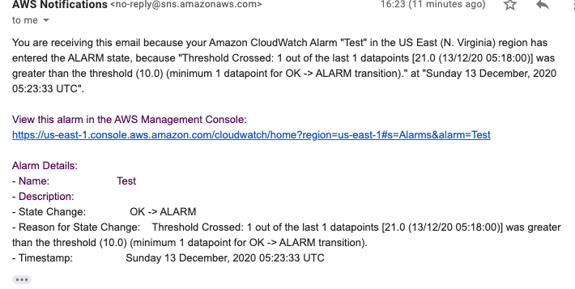

<!--
title: 'AWS Simple HTTP Endpoint example in NodeJS'
description: 'This template demonstrates how to make a simple REST API with Node.js running on AWS Lambda and API Gateway using the Serverless Framework v1.'
layout: Doc
framework: v1
platform: AWS
language: nodeJS
authorLink: 'https://github.com/serverless'
authorName: 'Serverless, inc.'
authorAvatar: 'https://avatars1.githubusercontent.com/u/13742415?s=200&v=4'
-->

# Serverless Framework Node REST API on AWS

This template demonstrates how to make a simple REST API with Node.js running on AWS Lambda and API Gateway using the Serverless Framework v1.

This template does not include any kind of persistence (database). For a more advanced examples check out the [examples repo](https://github.com/serverless/examples/) which includes Typescript, Mongo, DynamoDB and other examples.

## Setup

Run this command to initialize a new project in a new working directory.

`sls init aws-node-rest-api`

## Usage

**Deploy**


```
$ serverless deploy
```
    Service Information
    service: aws-node-rest-api
    stage: dev
    region: us-east-1
    stack: aws-node-rest-api-dev
    resources: 10
    api keys:
    None
    endpoints:
    GET - https://ngli3gkbl9.execute-api.us-east-1.amazonaws.com/dev/
    functions:
    hello: aws-node-rest-api-dev-hello

or to target a specific region
```
$ serverless deploy --region <aws-region>
```
Service Information
service: aws-node-rest-api
stage: dev
region: ap-southeast-2
stack: aws-node-rest-api-dev
resources: 10
api keys:
  None
endpoints:
  GET - https://50iqidwddh.execute-api.ap-southeast-2.amazonaws.com/dev/
functions:
  hello: aws-node-rest-api-dev-hello
**Invoke the function locally.**

```
serverless invoke local --function hello
```

**Invoke the function**

```
curl https://xxxxxxxxx.execute-api.us-east-1.amazonaws.com/dev/
```

**Test with postman**


**Task 2 Monitoring using cloudwatch and SNS*
    - set new Test event to test the lambda function 

    - setup CloudWatch metrics monitoring in CloudWatch
        - enable cross-region function for cloudwatch for both region monitoring
    - setup Alarms for over 9 error StatsCode in period of 5 minutes, named SliBreach
    - setup SNS topic to receive email when SliBreach alarm is triggered
    
    - setup SNS topics and verify recepient email address
    

**Task 5 CloudWatch dashboard for both region with cross-region monigoring enabled


**Task 6 Setup ReadOnly access IAM role for ops team

**Task 7 Using KMS to store secret parameters

Generate KeyID:
aws kms create-key --description kms-test --region us-east-1
Output:
    "KeyMetadata": {
            "AWSAccountId": "516627408046",
            "KeyId": "72c32c35-fb1f-4085-81f4-f45276f8971b",
            "Arn": "arn:aws:kms:us-east-1:516627408046:key/72c32c35-fb1f-4085-81f4-f45276f8971b",
            "CreationDate": "2020-12-13T19:58:23.522000+11:00",
            "Enabled": true,
            "Description": "kms-test",
            "KeyUsage": "ENCRYPT_DECRYPT",
            "KeyState": "Enabled",
            "Origin": "AWS_KMS",
            "KeyManager": "CUSTOMER",
            "CustomerMasterKeySpec": "SYMMETRIC_DEFAULT",
            "EncryptionAlgorithms": [
                "SYMMETRIC_DEFAULT"
            ]
        }

    aws ssm put-parameter --name /kms-test/value1 --value "newkeysssss" --type SecureString --key-id "72c32c35-fb1f-4085-81f4-f45276f8971b" --region us-east-1 --overwrite
    output:
        {
            "Version": 2,
            "Tier": "Standard"
        }
    
    -add kms.js handler and ssm encrpted parameter in yaml file
- 
    custom:
    settings:
    #SECRET_VALUE: ${ssm:/kms-test/value1}
    SECRET_VALUE: ${ssm:/kms-test/value1~true}

    provider:
    name: aws
    runtime: nodejs12.x
    profile: default
    region: us-east-1
    environment: ${self:custom.settings}
    
    - Depoy code and test with postman:
   Encrypted key:

   
Depoly again, after adding ~true after ssm parameter:    
 


**Task 8 Webhook
create a new lambda function for Webhook with SNS as the trigger //using slack for testing
    
    ** lambda function for webhook
    #!/usr/bin/python3.6
    import urllib3
    import json
    http = urllib3.PoolManager()
    def lambda_handler(event, context):
        url = "https://webhook.site/86c4f822-d880-4226-b922-4a5da849a543"
        msg = {
            "text": event['Records'][0]['Sns']['Message'],
            "icon_emoji": ""
        }        
        encoded_msg = json.dumps(msg).encode('utf-8')
        resp = http.request('POST',url, body=encoded_msg)
        print({
            "message": event['Records'][0]['Sns']['Message'], 
            "status_code": resp.status, 
            "response": resp.data
        })
    
    - Add SNS as trigger for Webhook lambda function to send alarm message to webhook/slack

  


